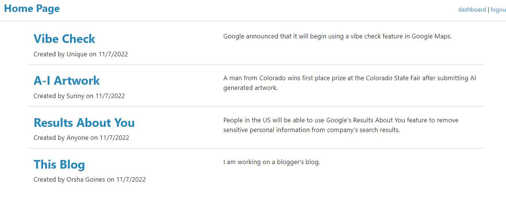

# The Tech Blog

  
  

 ## Table of Contents
 * [Project description](#Description)
 - [Usage](#Usage)
 - [License](#License)
 - [Contributing](#Contributing)
 - [Questions](#Questions)

 ## Description
 The Tech Blog is a site where developers can publish their thoughts regarding concepts, advancements and new
 technologies.   After signing up or logging in the user is presented with a page that allows them to blog.   Once added, the blog displays on a home page with other bloggers.   The user has the opportunity to delete or add blogs from their dashboard.
 The site was built using Javascript, Node.js, MYSQL, Sequelize and express-handlebars.
 
 
 
 ## Usage
  
 `npm start`  
 
 ## License
 GPL 3.0

 This project is licensed by the GPL 3.0.
 
 ## Contributing
 Currenty, there are no guidelines for contributions

## Questions

 Contact me with additional questions at 

 Orsha Goines at orshamarie@email.com or check out my work on GitHub at 

 [GitHub](https://github.com/[ogoines]
 
